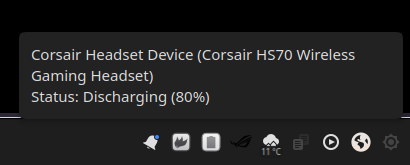
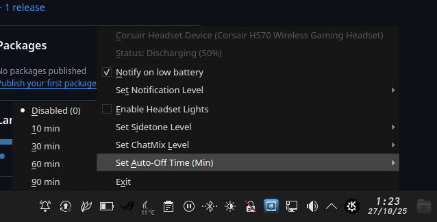

# 🎧 Headset Battery Indicator

A simple, lightweight Python script that displays the battery level of your wireless headset in your Linux system tray.

It uses **PySide6 (Qt)** for the tray icon, making it compatible with most modern desktop environments such as **KDE Plasma**, **GNOME**, **XFCE**, and **Cinnamon**.



---
## ⭐ Core Dependency: HeadsetControl

This script **does not work on its own** — it is a graphical front-end that relies entirely on the **[HeadsetControl](https://github.com/Sapd/HeadsetControl)** utility.

You **must** install `headsetcontrol` for this indicator to function.  
All credit for hardware communication and device support goes to the [Sapd/HeadsetControl](https://github.com/Sapd/HeadsetControl) project.

---
## 🚀 How to Get It

You have two options to install the indicator. The AppImage is the recommended method for most users.

### Option 1: AppImage (Recommended)

This is the simplest way. You get a single executable file that runs on almost any Linux distribution (Fedora, Ubuntu, Arch, etc.) without needing to install Python or PySide6.
**Remember to install HeadsetControl first**

1.  **[Download the latest `.AppImage` from the Releases page.]**
    (https://github.com/ruflas/headset-battery-indicator/releases/latest)

2.  Make the file executable:
    ```bash
    chmod +x Headset_Battery_Indicator-*.AppImage
    ```

3.  Run it!
    ```bash
    ./Headset_Battery_Indicator-*.AppImage
    ```
    (You can move this file to a safe directory, like `~/.local/bin`, and add it to your desktop's "Autostart" applications).

### Option 2: From Source (Advanced)

If you are a developer or prefer to build from source, you can install the script using `pip` and the `pyproject.toml` file included in this repository.

1.  **Install Dependencies**

    You must install the core requirements from your system's package manager first:
    ```bash
    # On Fedora:
    sudo dnf install headsetcontrol python3-pyside6
    
    # On Debian/Ubuntu:
    # (headsetcontrol may need to be built from source if not in your repo)
    sudo apt install headsetcontrol python3-pyside6
    ```

2.  **Clone and Install**

    ```bash
    git clone [https://github.com/ruflas/headset-battery-indicator.git](https://github.com/ruflas/headset-battery-indicator.git)
    cd headset-battery-indicator
    
    # Install the script into your system's Python path
    pip install .
    ```
    After this, you can run the indicator from your terminal just by typing `headset-battery-indicator`.
---

## ✨ Features

* **Dynamic Tray Icon:** Displays battery level and charging status at a glance.
* **Configurable Notifications:** Get a desktop notification (and a headset sound!) when your battery drops below a level you choose.
* **Full Context Menu:** Right-click the icon to:
    * See the connected device name and status.
    * Enable or disable low-battery notifications.
    * Set the notification threshold (10%, 20%, 30%, etc.).
* **Persistent Settings:** Remembers your notification preferences after a restart.
* **Tooltip Info:** Hover over the icon to see the device name and battery percentage.
* **Extremely low resource usage.**

---

## 🧩 Requirements

1. **[HeadsetControl](https://github.com/Sapd/HeadsetControl)** (Required)
2. **Python 3**
3. **PySide6** (Qt for Python)

---

## ⚙️ If you just want to use the .py file script

### 1. Install Dependencies

Make sure you have `headsetcontrol` and `python3-pyside6` installed via your package manager.

```bash
# On Fedora:
sudo dnf install headsetcontrol python3-pyside6

# On Debian/Ubuntu:
# (headsetcontrol may need to be built from source if not in your repo)
sudo apt install python3-pyside6 headsetcontrol
```

### 2. Clone the Repository

```bash
git clone https://github.com/ruflas/headset-battery-indicator.git
cd headset-battery-indicator
```

### 3. Make the Script Executable

```bash
chmod +x headsetcontrol_tray.py
```

---

## ⚙️ Usage & Configuration

### Right-Click Menu
This indicator is fully configurable. **Right-click the tray icon** at any time to:

* **Enable/Disable Notifications:** Toggle the "Notify on low battery" option.
* **Set Notification Level:** Choose the percentage for the low battery warning.
* **Toggle Headset Lights:** Enable or disable your headset's LEDs.
* **Set Sidetone Level:** Select your preferred sidetone volume from the submenu.

Your preferences are saved automatically and will be reloaded the next time you start the script.

### Command-line Arguments
You can also launch the script with these arguments:

* `-h` or `--help`: Shows a help message with all available options and exits.
* `-debug`: Launches in interactive debug mode. This allows you to type commands directly into the terminal (like `notification` or `setIcon battery-100-symbolic`) to test the script's behavior in real-time.

### Run on Startup (Autostart)
To run the script automatically when you log in:

1.  Open your **System Settings** / Control Panel.
2.  Go to **Startup and Shutdown** > **Autostart** (in KDE) or "Startup Applications" (in GNOME/XFCE).
3.  Add a new entry.
4.  In the "Command" field, enter:
    * **If you used the AppImage:** `/full/path/to/Headset_Battery_Indicator-*.AppImage`
    * **If you installed from source:** `headset-battery-indicator`

Your preferences are saved automatically and will be reloaded the next time you start the script.
