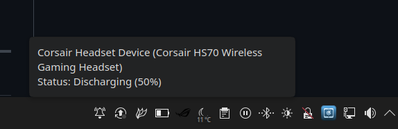

# 🎧 Headset Battery Indicator

[](LICENSE)
[](https://github.com/ruflas/headset-battery-indicator/releases)
[](https://www.python.org/)

A lightweight, modern tray indicator that shows your **wireless headset’s battery level**, **charging status**, and lets you **control LEDs and sidetone** — all powered by [HeadsetControl](https://github.com/Sapd/HeadsetControl).

It uses **PySide6 (Qt)** for the graphical interface and works seamlessly with **KDE Plasma**, **GNOME**, **XFCE**, **Cinnamon**, and other Linux desktop environments.



---

## 📘 Table of Contents
- [About](#about)
- [Features](#features)
- [Requirements](#requirements)
- [Installation](#installation)
  - [Option 1: AppImage (Recommended)](#option-1-appimage-recommended)
  - [Option 2: From Source](#option-2-from-source)
- [Usage](#usage)
- [Command-Line Options](#command-line-options)
- [Autostart](#autostart)

---

## 💡 About

`Headset Battery Indicator` is a simple GUI front-end for [HeadsetControl](https://github.com/Sapd/HeadsetControl).  
It provides a clean and convenient way to monitor your headset battery and manage device options directly from your system tray — without opening a terminal.

> ⚠️ This tool **depends entirely on HeadsetControl** for hardware communication.  
> Make sure `headsetcontrol` is installed and working on your system before running this indicator.

---

## ✨ Features

- **Dynamic Tray Icon** — Displays live battery percentage and charging state.
- **Custom Notifications** — Low-battery alerts with optional headset sound.
- **Device Control** — Toggle LEDs and adjust sidetone directly.
- **Context Menu** — Right-click for quick access to status and settings.
- **Persistent Configuration** — Saves preferences between sessions.
- **Low Resource Usage** — Lightweight and non-intrusive background service.
- **Device Info** - Shows headset name and current status.
- **Sidetone Control** - Adjust microphone sidetone volume.
- **ChatMix Control:** Added a new submenu to precisely set the ChatMix level (0-128, with presets like "Game Max," "Center," and "Chat Max").
- **Auto-Off Time Setting:** Added a menu to configure the automatic power-off time (0, 10, 30, 60, or 90 minutes), preventing the headset from dying when idle.
- **Advanced Diagnostics (New!)**: Includes a permanent, rotating log file (app.log) and a dedicated -debug mode with commands (log-test, setIcon) for easy troubleshooting and user support.
---

## 🧩 Requirements

| Dependency | Required | Description |
|-------------|-----------|-------------|
| [HeadsetControl](https://github.com/Sapd/HeadsetControl) | ✅ | Hardware communication backend |
| Python 3 | ✅ | Runtime environment |
| PySide6 | ✅ | GUI framework (Qt for Python) |

---

## 🚀 Installation

### Option 1: AppImage (Recommended)

This is the easiest way to run the indicator — no need to install Python or dependencies (just headsetcontrol).

> **Make sure `headsetcontrol` is installed first.**

1. **Download the latest AppImage**
   from the [Releases page](https://github.com/ruflas/headset-battery-indicator/releases/latest).

2. **Make it executable:**
   ```bash
   chmod +x Headset_Battery_Indicator-*.AppImage
   ```

3. **Run it:**
   ```bash
   ./Headset_Battery_Indicator-*.AppImage
   ```

You can move it to a folder like `~/.local/bin` and add it to your desktop’s “Autostart” list.

---

### Option 2: From Source (Advanced)

If you prefer to run the Python script directly or contribute to the code:

1. **Install Dependencies**

   ```bash
   # Fedora:
   sudo dnf install headsetcontrol python3-pyside6

   # Debian/Ubuntu:
   sudo apt install headsetcontrol python3-pyside6
   ```

2. **Clone and Install**

   ```bash
   git clone https://github.com/ruflas/headset-battery-indicator.git
   cd headset-battery-indicator
   pip install .
   ```

3. **Run**
   ```bash
   headset-battery-indicator
   ```

4. **Run just the script**
    ```bash
    python headset_battery_indicator.py
    ```
---

## ⚙️ Usage

Once launched, the indicator will appear in your system tray.

### 🖱️ Right-Click Menu
The context menu provides:
- **Device Info:** Shows headset name and current status.
- **Notifications:** Enable or disable low-battery alerts.
- **Threshold Setting:** Choose the battery level for notifications (10%, 20%, 30%, etc.).
- **LED Control:** Turn headset lighting on or off.
- **Sidetone Control:** Adjust microphone sidetone volume.

All your preferences are automatically saved.


---

## 🧠 Command-Line Options

You can launch the app with optional arguments:

| Option | Description |
|--------|--------------|
| `-h`, `--help` | Show help message and exit |
| `-debug` | Enable interactive debug mode (type commands like `notification` or `setIcon battery-100-symbolic`) |

Example:
```bash
./Headset_Battery_Indicator-*.AppImage -debug
```

---

## 🔄 Autostart

To run the indicator automatically on login:

1. Open your **System Settings**.
2. Go to **Startup and Shutdown** → **Autostart** (KDE) or **Startup Applications** (GNOME/XFCE).
3. Add a new entry:
   - **AppImage:** `/full/path/to/Headset_Battery_Indicator-*.AppImage`
   - **Source install:** `headset-battery-indicator`

Your settings and preferences will be restored automatically each time.
